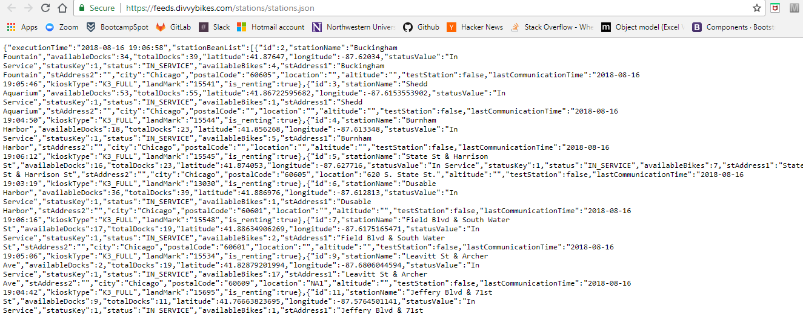
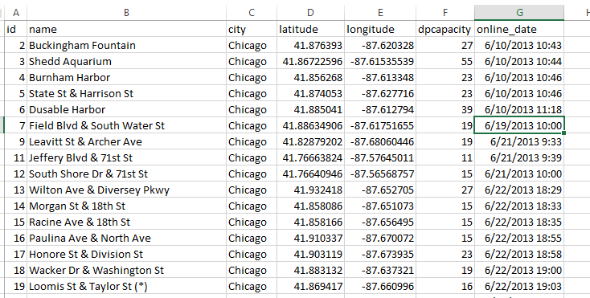
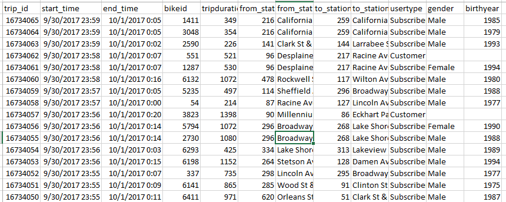
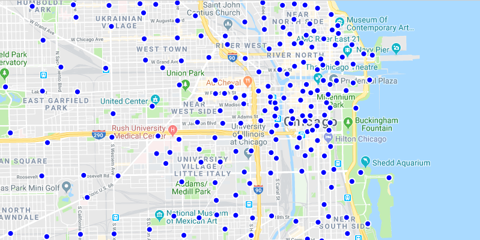
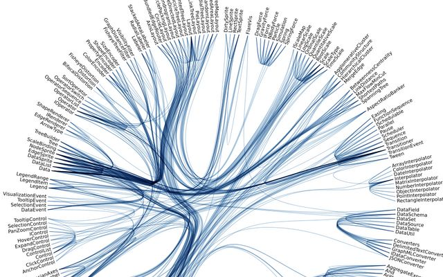

# Project 2

## This project aims to visualize Divvy bike station and usage.

## A link to Divvy dataset(s) and a screenshot.   

https://feeds.divvybikes.com/stations/stations.json

## Screenshots of "inspiring" visualizations

## A link to the primary GitHub repository

https://github.com/pbsilberman/project-2.git
